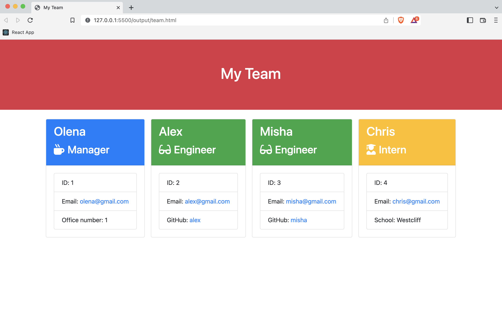
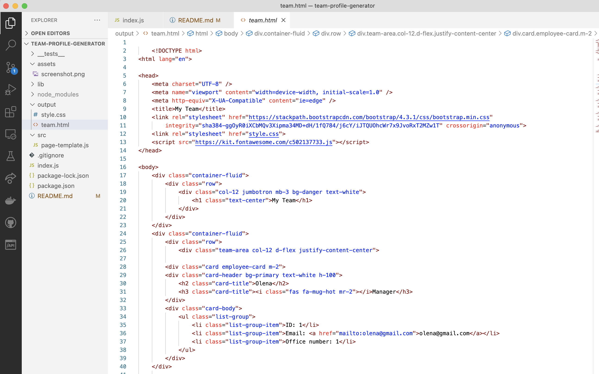
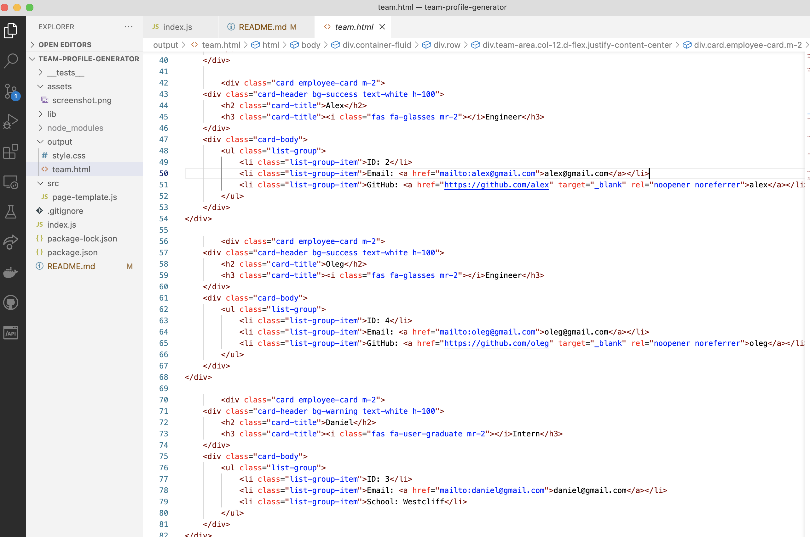
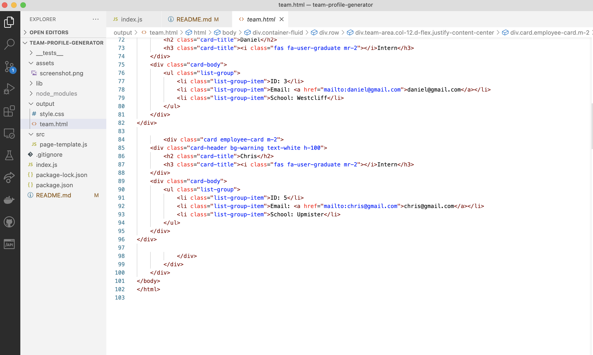

# team-profile-generator

## Description

team-profile-generator is a Node.js command-line application which takes in information about employees on a software engineering team using the [Inquirer package](https://www.npmjs.com/package/inquirer), then generates an HTML webpage that displays summaries for each person. 

## User Story

As a manager a user want to generate a webpage that displays my team's basic info so that a user have quick access to their emails and GitHub profiles.

## Instructions

```bash
node index.js
```

<p float="center">




</p>

<a href="https://drive.google.com/file/d/1siUsY_tkLWRTxy2jOxlZqQ34C_mHxWnf/view" > Link to the demo </a>
